# Delivery Ops RCA Agent

**Conversational root-cause analysis for quick-commerce delivery SLAs.**
LangGraph · MCP · DuckDB · FastAPI

Ask *"Why did STORE_003 underperform?"* in plain English and get a structured
root-cause breakdown — demand spike, order pileup, rider supply — computed from
231,000 order-hours of real delivery data.

```
Q: Why did STORE_003 underperform?

## STORE_003 — Bangalore — 2026-04-22
**991 orders · 760 breached (76.7%) · weighted avg OR2A 317.7 min**

### STORE_003 — Hour 8 — avg OR2A: 562.0 min (threshold: 0 min)
1. Demand Spike: NO — 76 orders vs 103 projected (-26.2%)
2. Pileup: YES — 4 orders carried from previous hour (SUSTAINED — 4 consecutive hours: 7–10)
3. Supply:
   a. Booking: YES — 32 of 59 slots booked, 3 cancelled (49%)
   b. Utilization: NO — man_hour ratio 0.88 (1 no-shows)

**Summary**: OR2A was 562.0 min over threshold due to sustained pileup across
4 consecutive hours (hours 7–10), with 4 orders carried in from hour 7 and a
booking gap (only 32 of 59 rider slots filled, 3 cancelled, 49%).
```

---

## Contents

- [What this is](#what-this-is)
- [The one architectural claim](#the-one-architectural-claim)
- [Quick start](#quick-start-5-minutes)
- [Try it](#try-it)
- [Screenshots](#screenshots)
- [How it works](#how-it-works)
- [Project layout](#project-layout)
- [Testing](#testing)
- [Design decisions](#design-decisions-and-why)
- [Known limits](#known-limits)
- [AI tools used](#a-note-on-ai-tools)

---

## What this is

A delivery network runs thousands of stores. When a store misses its SLA, an ops
manager needs to know **why** — was demand higher than forecast? Did orders pile
up from the previous hour? Did riders fail to show?

Answering that today means writing SQL. This agent answers it in conversation,
and holds context across turns:

```
You:   Why did STORE_003 underperform?
Agent: [full RCA — three checks per problem hour]

You:   Walk me through the morning hours
       ^ no store named — it carries STORE_003 forward

You:   What about STORE_091?
       ^ no verb at all — it carries the intent forward
```

**The metric.** `OR2A` (*Order Ready to Assignment*) is the minutes between an
order being packed and a rider being assigned to it. It is the network's primary
SLA metric — lower is better, and the threshold here is **0 minutes**, so any
order not assigned immediately counts as a breach.

---

## The one architectural claim

> **The language model never computes a number.**

It does exactly two things: turn a sentence into structured intent, and turn
already-computed facts into one English sentence. Every figure — every average,
every ranking, every threshold check — comes from tested Python and tested SQL.

You can verify this the blunt way: **delete your API key and re-run.** Every
number is byte-for-byte identical. Only the prose changes.

```
$ python check_agent.py          # with a key
$ mv .env .env.bak && python check_agent.py   # without one
  48 passed, 0 failed            # both times
```

That is not a stylistic preference. This dataset has two traps that produce
answers which are *valid, fast and silently wrong*:

| Trap | The tempting query | How wrong |
|---|---|---|
| Unweighted rollup | `AVG(w_avg_or2a)` | **−40% to +35%**, and it **reorders the cities** — Chennai is 3rd worst correctly, 6th naively |
| Slot replication | `SUM(current_size)` per hour | **1.75×** — invents 55,000 rider slots that don't exist |

Both are asserted numerically in the test suite, so nobody can quietly
reintroduce them.

---

## Quick start (5 minutes)

### Prerequisites

- **Python 3.10+** (`python3 --version`)
- **Node.js 18+** — only for the MCP server, which runs via `npx`
- An **API key** — optional. Everything works without one; see below.

### 1. Clone and install

```bash
git clone https://github.com/<your-username>/delivery-ops-rca-agent.git
cd delivery-ops-rca-agent

python3 -m venv .venv
source .venv/bin/activate          # Windows: .venv\Scripts\activate

pip install -r requirements.txt
```

### 2. Add an API key (optional but recommended)

```bash
cp .env.example .env
```

Open `.env` and paste a key. **Groq is free and needs no credit card** —
get one at [console.groq.com/keys](https://console.groq.com/keys):

```
LLM_PROVIDER=groq
GROQ_API_KEY=gsk_your_key_here
```

> **No key? It still runs.** A deterministic rule-based classifier takes over and
> every number stays identical — you lose only the conversational phrasing and
> the generated-SQL fallback. This is the architectural claim above, made
> testable.

### 3. Run it

```bash
python -m uvicorn app.main:app --reload --port 8000
```

Open **<http://localhost:8000>** — the chat UI is served from `/`.

> Use `python -m uvicorn`, not bare `uvicorn`. The bare command can resolve to a
> system Python outside your virtualenv and fail with
> `ModuleNotFoundError: No module named 'duckdb'`.

### 4. Check it came up cleanly

```bash
curl -s localhost:8000/health
```

```json
{
  "status": "ok",
  "rows": 3813,
  "stores": 233,
  "cities": 9,
  "llm_provider": "groq/openai-gpt-oss-120b",
  "mcp": "connected"
}
```

`"llm_provider": "rule-based"` means no key was found — expected if you skipped
step 2. `"mcp": "connecting"` is normal for the first few seconds; the MCP server
warms up in the background so it never blocks startup.

### Troubleshooting

| Symptom | Cause | Fix |
|---|---|---|
| `ModuleNotFoundError: duckdb` | bare `uvicorn` used the system Python | `python -m uvicorn ...` |
| `llm_provider: rule-based` with a key set | `.env` not loaded, or key has quotes | No quotes, no spaces around `=` |
| `mcp: unavailable` | `npx` missing or offline | Install Node 18+. Nothing else is affected |
| Port 8000 busy | another process | `--port 8001` |
| 429 from the provider | free-tier quota | The agent degrades to deterministic answers automatically |

---

## Try it

Paste these in order — they build on each other and each shows something
different.

**The core RCA**
```
Why did STORE_003 underperform?
```

**Multi-turn — no store named, context carries it**
```
Walk me through the morning hours
```

**It refuses to guess**
```
What about TBC8?
→ I don't have a store called 'TBC8'. Store codes look like STORE_001 to STORE_233.
```

**Grouped ranking — a window function under the hood**
```
top 5 stores of each city
```

**Zero results is a real answer**
```
cities with or2a above 200 min
→ Nothing crossed that line — no cities had Avg OR2A > 200.0 min on 2026-04-22.
```

**It knows what the data can't tell you**
```
is it getting worse?
→ I can't answer that — the dataset is a single day, 2026-04-22.
```

**Answered from the reference docs, over MCP**
```
what is or2a?
```

**Two questions, two answers**
```
How did Bangalore do, and which store was worst?
```

**Generated SQL, shown and labelled**
```
what percentage of total orders came from the 10 busiest stores
→ [SQL block] ⚠️ Generated query — screened, not verified.
```

---

## Screenshots

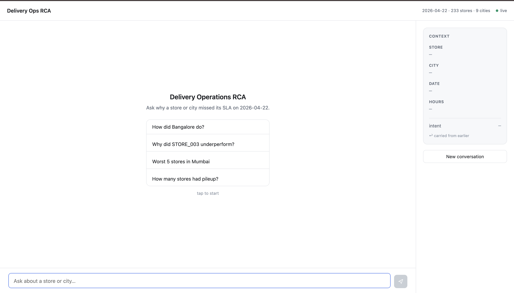

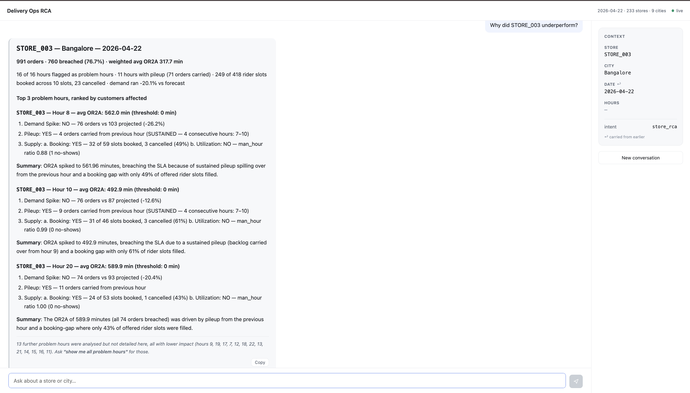

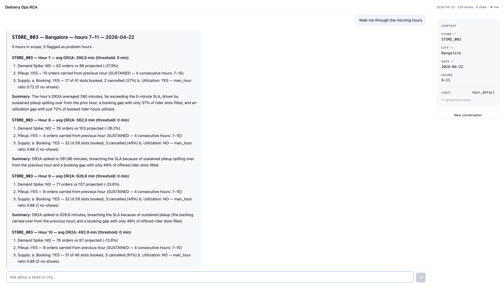

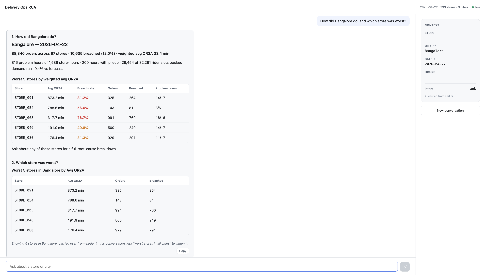

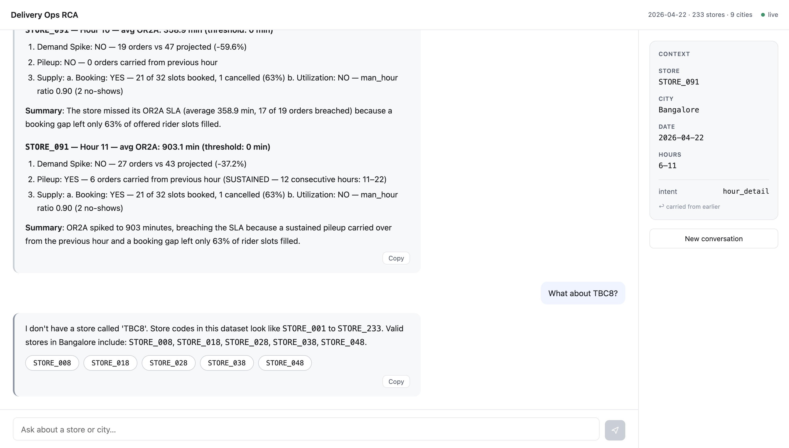

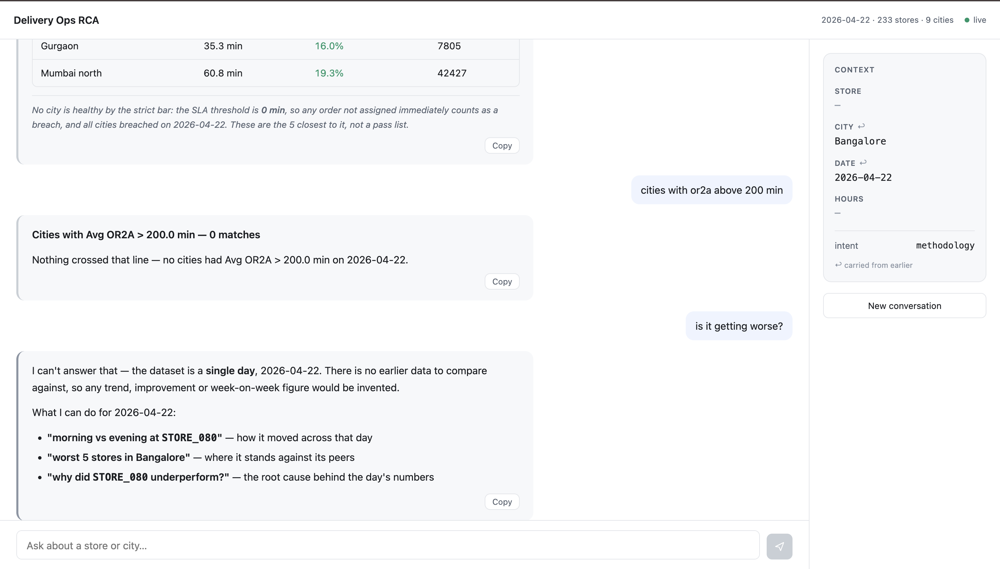

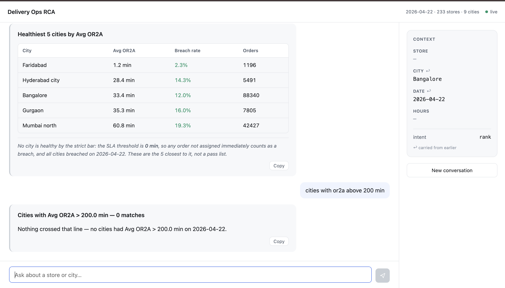

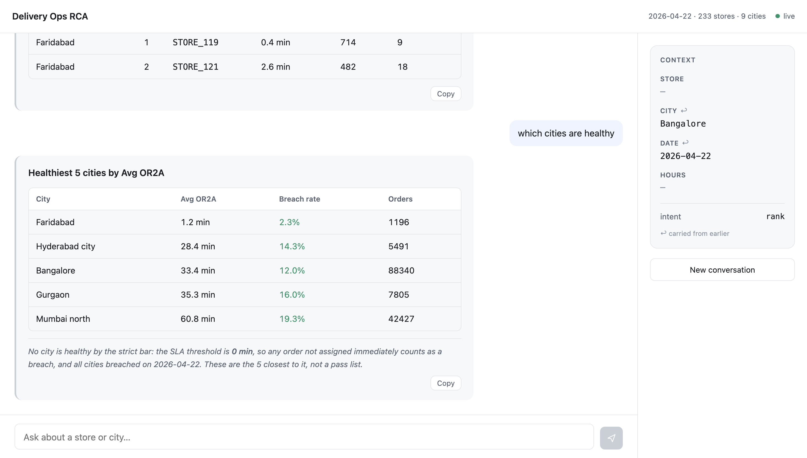

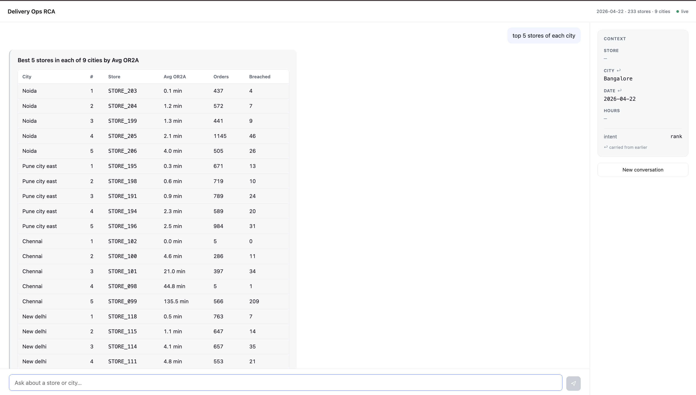

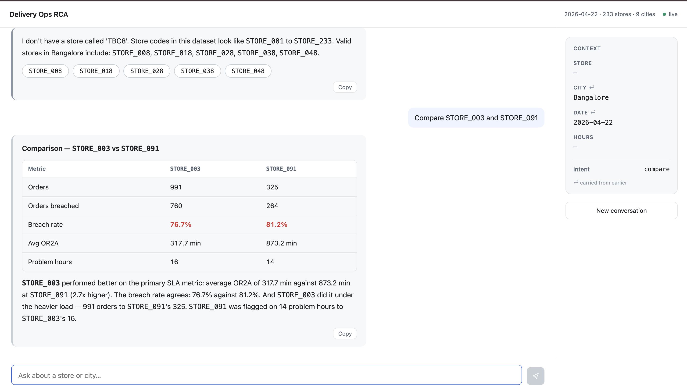

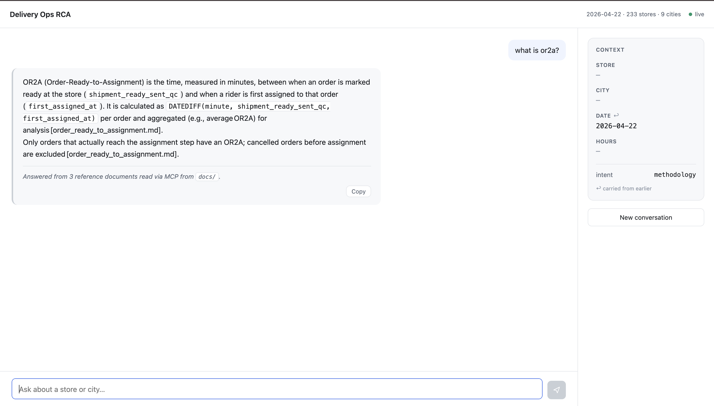

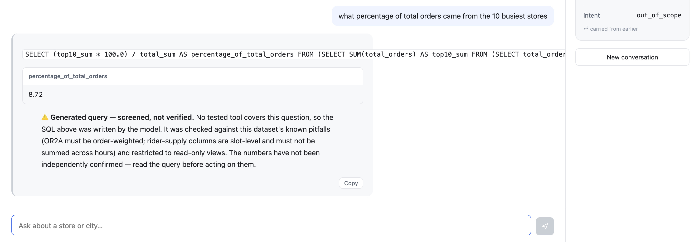

---

## How it works

```
                          START
                            │
                     split_questions        one message may hold several
                            │
                     classify_intent        LLM #1 — sentence → structure
                            │
                    resolve_entities        Python — inherit, resolve, or decline
                       ╱         ╲
                  declined      routed by intent
                     │               │
                    END    ┌─────────┴──────────┬──────────┬─────────────┐
                           │         │          │          │             │
                    city_summary  store_rca  hour_detail  tier2     methodology
                           │         │          │          │             │
                           └─────────┴────┬─────┴──────────┘         (MCP docs)
                                          │
                                      narrate                LLM #2 — prose only,
                                          │                  over finished facts
                                         END
```

### Three tiers, three guarantees

| Tier | What it is | Provenance |
|---|---|---|
| **1 — RCA engine** | The playbook's four checks, in tested Python | `validated` |
| **2 — Parameterized tools** | 9 tools: rank, compare, threshold, grouped rank, time-of-day, count, lookup, healthiest, hour profile | `validated` |
| **3 — Generated SQL** | For questions no tool covers. Model writes the query | `screened` |

Tier 3 is not "text-to-SQL with a disclaimer". It has three layers:

1. **Context** — the prompt explains the grain and the pitfalls *(advice)*
2. **Shaped views** — the wrong query cannot be **written** *(structural)*
3. **The screen** — the wrong query cannot be **executed** *(mechanical)*

Layer 2 does the real work. `or2a_order_minutes` is a pre-multiplied column, so
the correct weighted rollup is also the *obvious* query. The replicated supply
columns are simply **absent** from the hourly view — a column that isn't in the
schema cannot be double-counted.

Layer 3 then rejects `AVG()` on any OR2A column, any table outside the
allowlist, anything that isn't a single `SELECT`, and caps rows at 50. A
rejection is fed back to the model with the exact correction; two retries, then
it declines.

### What is a tool, what is a prompt, what is code

This was the design question, and the split is deliberate:

- **Deterministic code** — every number, every flag, every threshold comparison,
  every ranking, all rendering, the entire multi-turn slot machinery, and all
  lexical facts about the message (which nouns appeared, whether a number is a
  quantity or a store code).
- **A tool** — anything with a stable shape and a testable contract. Nine of them.
- **The prompt** — only intent classification, question splitting, one summary
  sentence, and Tier-3 SQL generation.

The dividing line: **if being wrong would produce a plausible-looking number,
it's code.**

### MCP

An open-source MCP server ([`@modelcontextprotocol/server-filesystem`](https://github.com/modelcontextprotocol/servers))
is spawned over stdio and reads `docs/` — the three reference documents that
define OR2A, the RCA playbook and the schema.

Definition questions are answered from those files, not from the model's
memory. The whole corpus is ~1,800 tokens — smaller than the classifier prompt —
so **all of it** goes into the prompt and retrieval never happens. There is no
RAG here on purpose: selecting a subset of 1,800 tokens in order to send a
subset of 1,800 tokens buys nothing and adds a way to miss.

MCP connects in a **background thread**, so a missing `npx` or no network delays
nothing. Boot takes ~6 ms.

---

## Project layout

```
app/
  db.py           CSV → DuckDB, 4 derived columns, no cleaning
  validation.py   16 invariants asserted at startup
  tables.py       derived tables + the 4 read-only views Tier 3 may query
  rollups.py      weighted store/city aggregates
  rca.py          the four playbook checks
  render.py       the mandated markdown format
  tools.py        9 parameterized tools + the metric registry
  entities.py     store/city resolution, aliases, safe declines
  llm.py          provider abstraction + rule-based fallback
  prompts.py      all four prompts, in one file
  nodes.py        LangGraph nodes
  graph.py        the state machine
  sql_path.py     Tier 3: generate → screen → run
  mcp_client.py   MCP over stdio
  main.py         FastAPI — 9 endpoints
  state.py        session slots

static/           chat UI (vanilla JS, no build step)
docs/             the three reference documents, read via MCP
data/             the source CSV
tests/            373 tests
```

### API

| Endpoint | Purpose |
|---|---|
| `POST /chat` | one turn — `{session_id, message}` |
| `GET /health` | row counts, provider, MCP status |
| `GET /entities` | stores and cities |
| `GET /session/{id}` | full transcript + resolved context |
| `GET /debug/graph` | the LangGraph diagram as Mermaid |

Interactive API docs at **<http://localhost:8000/docs>**.

---

## Testing

```bash
python -m pytest              # 373 tests, ~3s
```

Then the demonstration scripts, which print rather than assert silently:

```bash
python verify.py              # engine numbers, no LLM involved
python check_turns.py         # multi-turn inheritance, turn by turn
python check_agent.py         # 48 end-to-end assertions
python check_llm.py           # classifier accuracy (needs a key)
python check_sql.py           # Tier 3 + the two trap questions (needs a key)
python check_mcp.py           # MCP connection and document reads
```

**What the tests actually protect.** Not "does it run" — a wrong query runs
perfectly. Several tests assert the *danger* rather than the behaviour:

```python
def test_the_naive_average_really_is_wrong_and_reorders_cities(con):
    assert worst_err > 0.30,  "the naive average is no longer badly wrong"
    assert correct_order != naive_order, (
        "the naive average no longer changes the ranking — the strongest "
        "argument for the screen has gone")
```

If that stops being true, the screen's strictness is unjustified. While it holds,
nobody may quietly relax it.

---

## Design decisions, and why

**Threshold is 0 minutes, and nothing is "healthy".**
The reference doc says `Healthy: avg OR2A ≤ 0` *and* "typically 5–8 min". Under
the literal rule every city breaches. Asked "which cities are healthy", the agent
returns the closest and states plainly that **none clear the bar and what the bar
is** — rather than inventing a softer threshold and presenting survivors as a
pass list.

**Impact ranking, not exhaustive output.**
STORE_003 has 16 problem hours. Rendering all of them is 168 lines nobody reads.
The agent details the top 3 by customers affected and **names the rest** — so
truncation is visible, never silent.

**Booking ratio is read, never recomputed.**
The documented formula `booked/current` reproduces 32.7% of rows. The formula
that reproduces 100% is `(booked − cancelled)/current`. We read the stored
column, so our numbers always agree with the ops team's own SQL.

**An unresolvable entity is declined, never guessed.**
`TBC8` doesn't exist. Fuzzy-matching it to `TBC8-something` would produce a
confident answer about the wrong store — far worse than declining.

**Grain facts are computed, never asked.**
Whether the message said "stores", whether a number is a quantity or a store
code, whether a city noun is a subject or a scope — all lexical facts about a
string. Python answers them exactly; a model answers them slowly, variably and
sometimes wrongly.

---

## Known limits

Stated plainly, because an agent that never says "I can't" can't be trusted when
it says "I can":

- **One day of data** (2026-04-22). No trends, no week-over-week — the agent
  declines these explicitly rather than describing one day as a trend.
- **Sessions are in-memory.** A restart clears them; the brief did not require
  persistence.
- **Nested grouping** — *"top 5 stores in each of the worst 3 cities"* degrades
  to a flat top-5 rather than answering the nested form.
- **`BETWEEN` thresholds** — *"or2a between 10 and 20 min"* is declined rather
  than guessed at.
- **Tier 3 answers are `screened`, not `validated`.** The known traps are
  blocked; the answer itself is not independently verified, and the SQL is always
  shown so it can be checked.

---

## A note on AI tools

Required by the brief, and worth being precise about.

**What I did myself.** The design work: reading the dataset, finding the traps
(the unweighted rollup and the slot-level replication), deciding the threshold
question, choosing impact ranking over exhaustive output, and drawing the line
between what is a tool, what is a prompt and what must be deterministic code.
Every architectural decision here — three tiers, provenance labels, declining
rather than guessing, the LLM never touching a number — is mine, and I can defend
each one in the walkthrough.

I also drove the entire debugging cycle: running the agent, finding bugs by
reading output, and deciding which were real problems versus acceptable
behaviour. Roughly 25 distinct bugs were found and closed this way — several of
them, like a threshold value being silently read as a store code, only surfaced
through deliberate adversarial testing I designed.

**Where AI tools helped.**

| Tool | Used for |
|---|---|
| **Claude (Anthropic)**, via an agentic coding environment | Pair-programming throughout — implementing modules against decisions I made, proposing options with tradeoffs when I asked for them, writing test scaffolding, and drafting documentation. I reviewed and directed every change. |
| **Groq API** (`openai/gpt-oss-120b`) | The runtime LLM — intent classification, question splitting, summary sentences, Tier-3 SQL |
| **`@modelcontextprotocol/server-filesystem`** | The MCP server the agent consumes |

My working method was to state a problem, ask for options with reasoning, choose
one, then review the implementation. Where I disagreed with a proposal I said so
and it was changed — the inherited-scope behaviour is one example: the first
implementation dropped an inherited city on "list all stores", I argued that
breaks conversational consistency, and it was reverted to inherit-and-disclose.

**What I discarded.**

- **RAG for the reference documents.** Considered, measured, rejected. The whole
  corpus is ~1,800 tokens — smaller than the classifier prompt. Embeddings and a
  vector store would have been several hours of work to produce a *worse* answer.
  A test now fails if the corpus grows past the point where that reasoning holds.
- **Letting the LLM write SQL freely.** The first instinct for "answer any
  question". Rejected after measuring the damage: `AVG(w_avg_or2a)` is wrong by
  up to 40% and changes the ranking. Replaced with shaped views that make the
  wrong query unwritable.
- **Dumping conversation history into the prompt** for multi-turn. Simpler to
  write, impossible to inspect. Replaced with explicit slots, so the resolved
  context is visible in the UI and assertable in tests.
- **Prompt-only guardrails.** A warning in a prompt is advice a model can ignore,
  with nothing downstream able to tell whether it did. Replaced with mechanical
  screening.
- **Gemini as the provider.** Abandoned after the issued key hit a known
  zero-quota restriction. Groq replaced it in one config line — which is what the
  provider abstraction is for.
- **Retrieval-based document answering.** The original implementation returned
  three raw excerpts, which for *"what is OR2A?"* were three chunks of the *same
  file*. Replaced with whole-corpus synthesis.


---

## License

MIT
